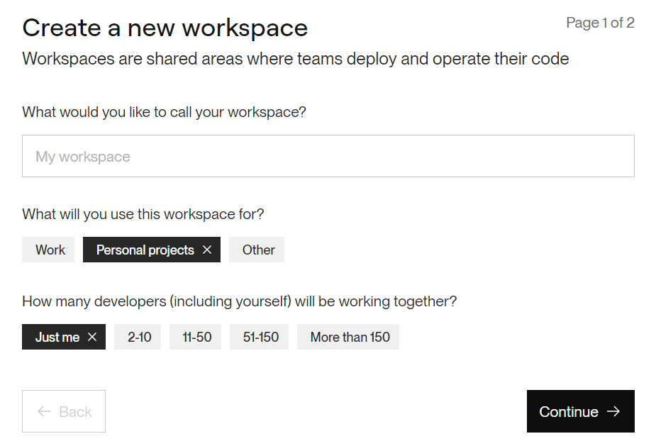
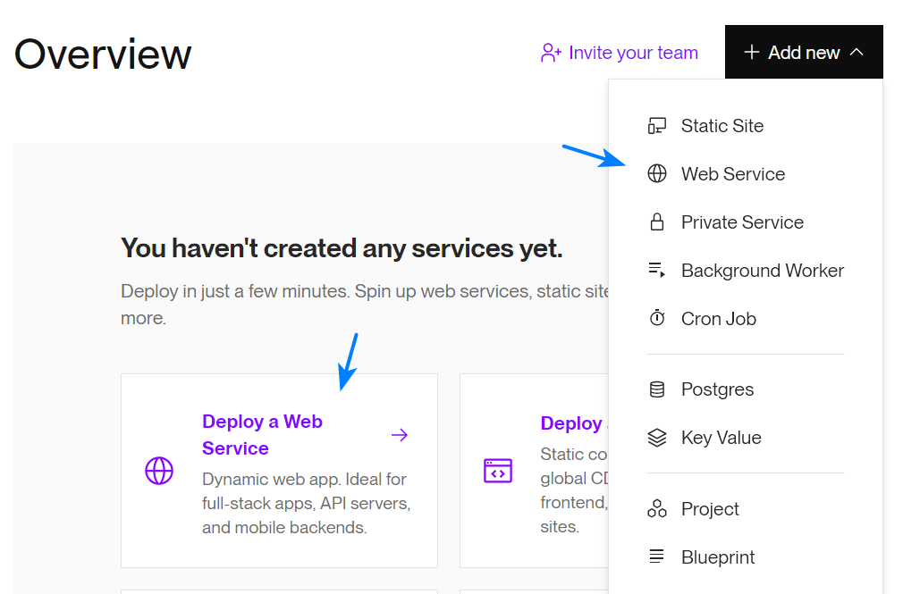
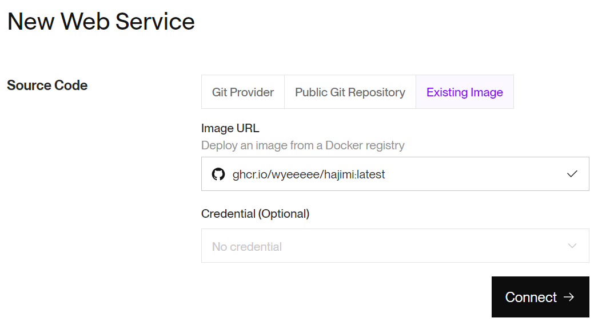
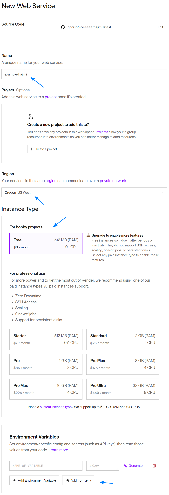
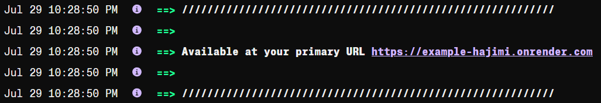
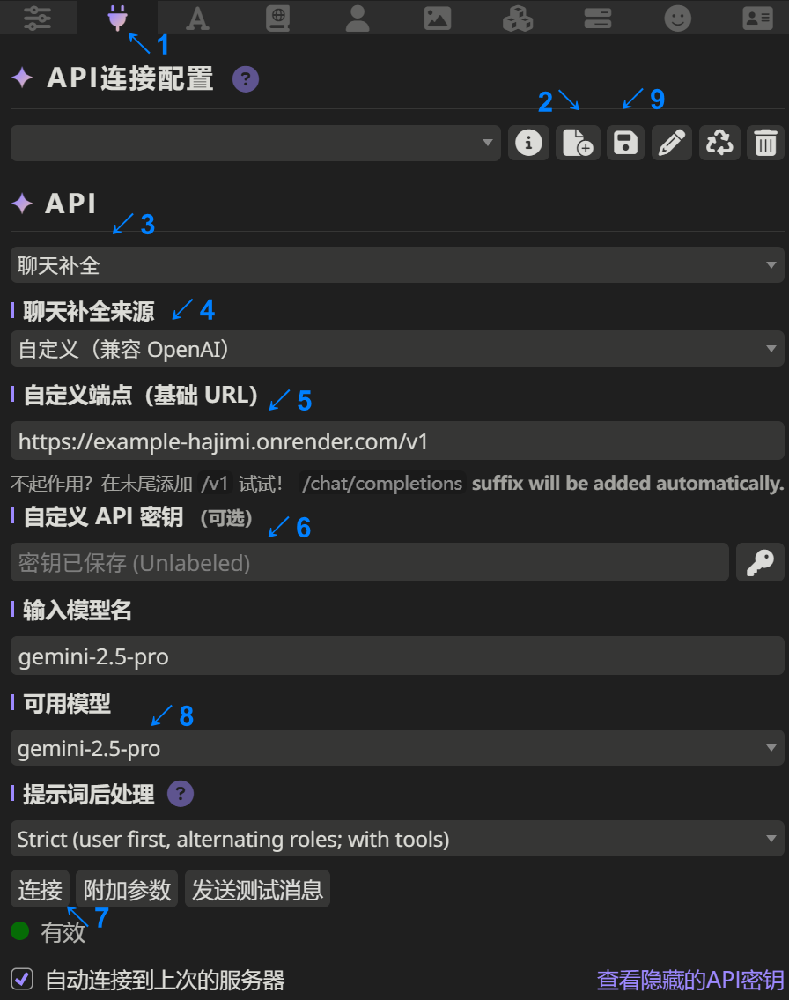
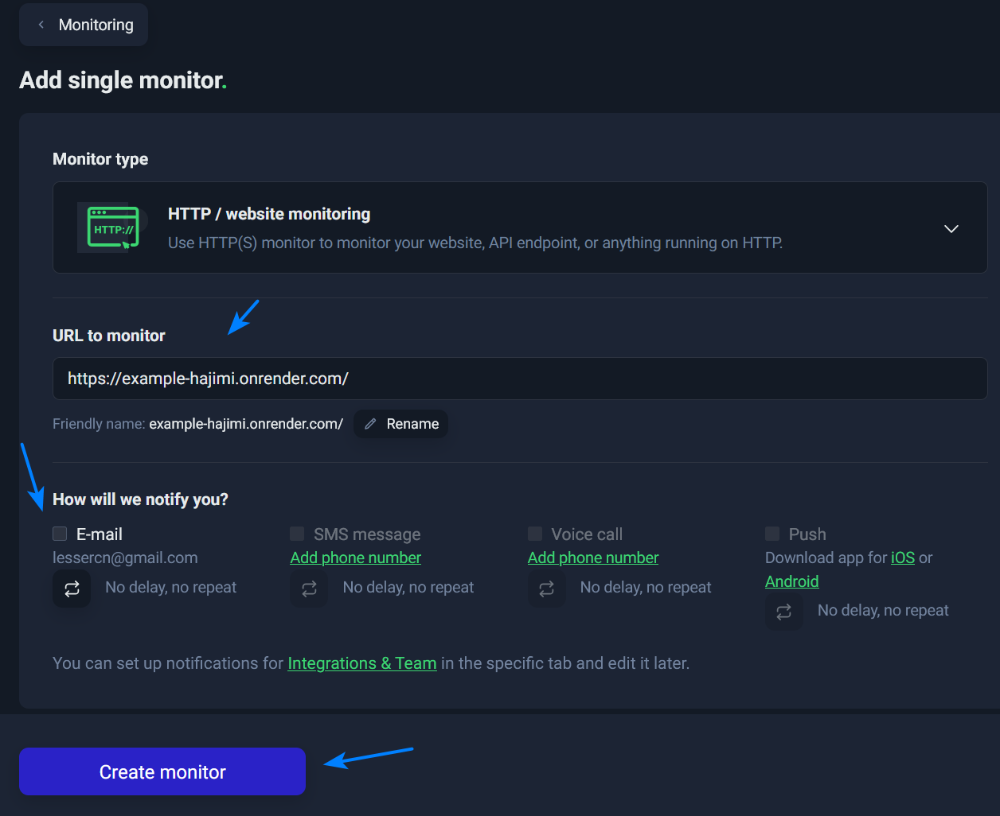

# 通过Render免费部署Hajimi

通过Render部署，具有以下特点

- 免费
- 部署简单
- 国内可直连
- 稳定，不易崩溃
- 不会被Render封禁
- 可能需要绑信用卡

## 注册

访问Render官网：

https://dashboard.render.com/register

注册账号后会向邮箱发送验证邮件，点击验证

可能会需要绑信用卡验证，但仅作为验证，付费会立即退回，后续也可免费使用

## 创建工作空间

首次登录时会要求创建第一个工作空间

点击Continue两次后创建完成

## 部署Web服务

如图点击创建Web服务

点击Existing Image，填入镜像`ghcr.io/wyeeeee/hajimi:latest`

填写自定义的服务名称，选择区域，选择实例类型为Free，然后对于环境变量点击Add from .env

输入`PORT=7860`，然后换行并粘贴来自 https://github.com/wyeeeee/hajimi/blob/main/.env 的内容并按需修改，然后点击Add variables，再点击Deploy Web Service

等待一会，直到显示`Available at your primary URL ...`，此时已经完成部署，可以通过后述地址访问管理页面

### 更新

后续若需要更新，点击Deploy latest reference

## 在酒馆中使用

在酒馆中点击API连接配置（插头），API选择聊天补全，聊天补全来源选择自定义（兼容OpenAI），自定义端点填入前述地址并在最后追加/v1，自定义API密钥填入前述环境变量中的访问密码（默认是123），点击连接后可用模型将出现列表，选择可用模型后保存即可

## 保活

每个账号具有每月合计750小时的免费实例时间，也就是说足够一个免费实例持续运行整月

而免费实例在15分钟不活动后将会停止运行，重新访问时将会需要重启，可能需要数十秒的时间，因此可以通过 https://uptimerobot.com/ 等保活

通过上述地址注册并登录后，点击New monitor

将前述管理页面的地址填入URL to monitor，取消勾选提醒方式中的E-mail（如果不想被打扰），再点击Create monitor即可，此时将每5分钟访问一次，从而阻止实例停止运行

