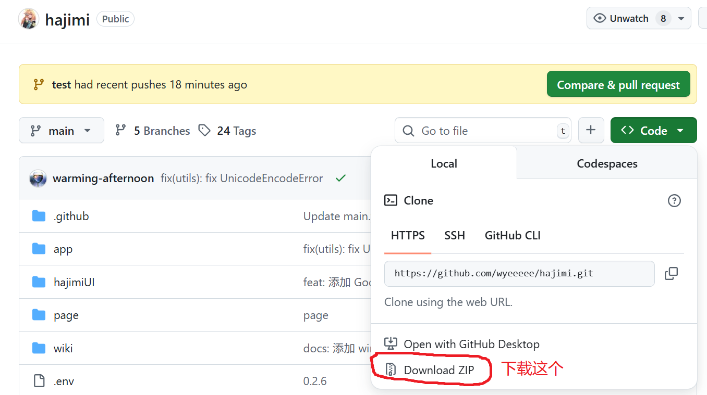
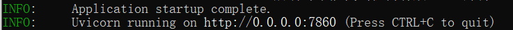
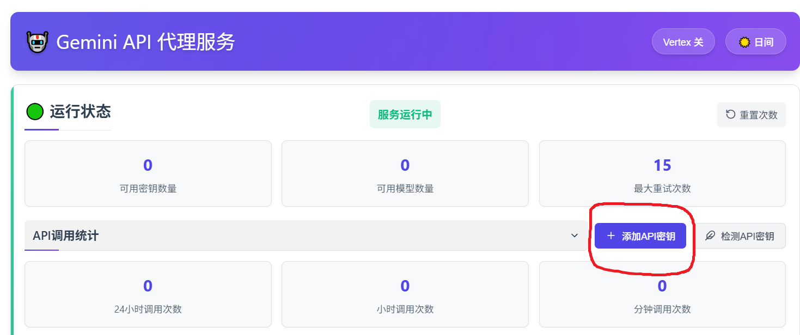
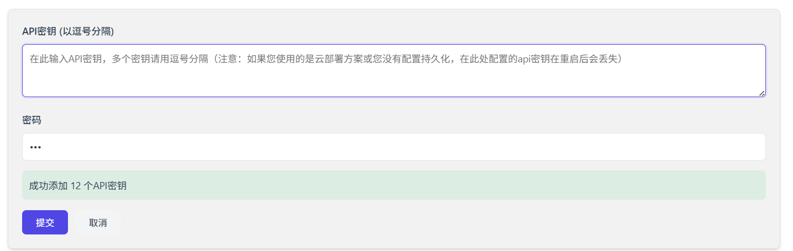
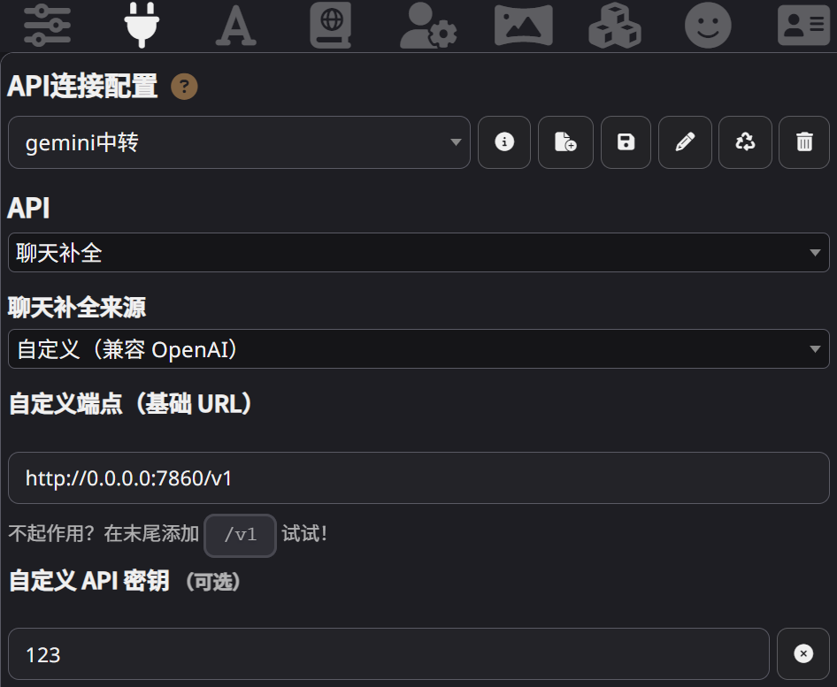

# hajimi
- 本项目目前分为两部分[studio轮询], [vertex模式]，两部分互相独立互不影响

## Gemini主流白嫖平台
- AI studio（Google账号注册）
  - 免费 (rpd 100, rpm 5, tpm 250k, tpd 6M)
- vertex AI（绑卡）
  - 收费：2.5 pro-exp（每分钟上下文131k）
- vertex AI express（快速模式，无需绑卡，点击领取，有些人能领有些人不能）
  - 只能使用：0506pro-pre，flash0520（0325pre=0506pre，0417flash=0520flash）

## 本项目支持
- 轮询模式：使用 AI studio key
  - 除密码外，变量全部是轮询模式使用，vertex模式无效
- vertex模式：使用vertex AI，vertex AI express
  - vertex AI需要json文件，vertex AI express只需要填写key

# windows 部署教程

首先，下载项目到本地

下载项目后，解压到电脑本地，点击 "Windows双击这里运行.bat"

会弹出一个黑窗口(终端)，请稍作等待。

理想情况下，很快终端中会出现以下信息，这表明项目开始正常运行。

> 注 ：终端在使用项目时不能关 

同时，浏览器会弹出一个网页，那就是 hajimi 项目的前端

前端网页可以关闭，关闭它并不会影响项目的正常使用

到此，项目本身就部署完成了，接下来选择 [studio轮询], [vertex模式] 其中一个进行使用

## ai studio 轮询

点击网页左侧的  “添加 API 密钥” 按钮

将从 ai Studio 获取的 key 填入上方输入框，并在下方的密码处填写 123，点击保存

> key可以一次输入多个，用英文逗号分隔即可识别

(提示：谷歌不向中国提供服务，因此梯子请选择其他国家的节点，最好是美国。若依然获取不到模型列表，请开启 全局/TUN ) 

到此，ai studio 轮询部分的基础配置完成

## vertex 模式

- 点击右上角打开`vertex`
- 填写`Vertex 配置`
- 分支
  - 如果你是vertex绑卡用户：直接填写`Google Credentials JSON`和你的密码，点击保存（不要打开`Vertex Express`）
  - 如果你是vertex快速模式用户：打开`Vertex Express`，在`Vertex Express API密钥`填写你的AQ密钥和你的密码，点击保存（不要碰`Google Credentials JSON`你没有也不需要）
  - 如果你是天选用户，两个都有，那么开了快速就默认用的是快速key

## 项目使用

本节以酒馆 (SillyTavern) 为例，解释如何使用 hajimi 项目

在 API 连接配置界面，API 选择"聊天补全"

聊天补全来源选择 "自定义（兼容 OpenAI）"

自定义端点（基础 URL）填入 http://0.0.0.0:7860/v1  (或者 http://127.0.0.1:7860/v1 )

密码填写 123 (或者之后你自行配置的密码)

如果您在填写完以上信息后，下方没有模型供您选择，请您点击连接按钮，此时您应该可以看到模型，选择模型即可使用

## 高级配置

根据项目主页的功能/配置介绍，进行相应配置

###  错误自查

遇到问题请先查看以下的 **错误自查** 文档，确保已尝试按照其上的指示进行了相应的排查与处理。

- [错误自查](./wiki/error.md)